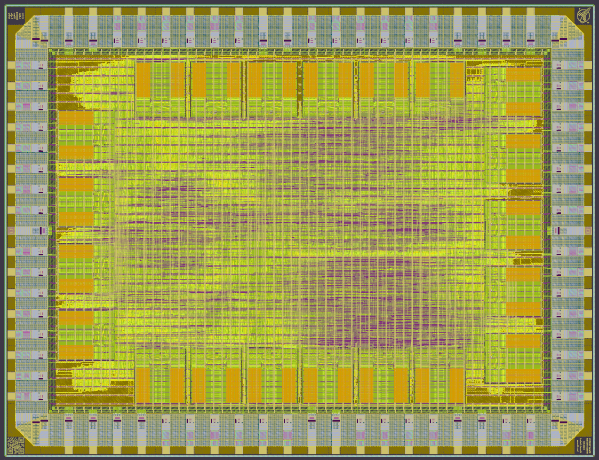

**RISC-V Linux/XV6 SoCs**
================================
**KianV SV32 (MMU) RV32IMA Zicntr Zicsr Zifencei SSTC Linux/XV6
SoC**, a robust RISC-V design with full virtual memory support, seamlessly
running Linux and XV6.
[KianV SV32 RV32IMA SoC](https://github.com/splinedrive/kianRiscV/tree/master/linux_socs/kianv_mc_rv32ima_sv32)

# LinuxSoC V2

Here is my reworked Linux SoC, simpler, derived from my new full custom ASIC.
[KianV SV32 RV32IMA SoC v2](https://github.com/splinedrive/kianRiscV/tree/master/linux_socs/LinuxSoC_v2)


**Linux ASIC Designs**
======================
Find my new full-custom RISC-V Linux KianV ASIC SoC as part of the [wafer.space](https://wafer.space) GF180MCU shuttle run.
[KianV GF180MCU](https://github.com/splinedrive/gf180mcu-kianv-rv32ima-sv32)


### External Recognition

At the Linux Plumbers Conference 2025 (Tokyo), D. Jeff Dionne highlighted the recent emergence of fully open-source silicon platforms that return from fabrication and boot mainline noMMU Linux, calling this capability “incredibly powerful”.

KianV demonstrates this end-to-end workflow in practice: open-source RTL, open-source EDA and PDK (skywater130), TinyTapeout fabrication, and mainline uLinux boot on real silicon.

Reference: Linux Plumbers Conference 2025 – noMMU Linux BoF
https://www.youtube.com/watch?v=_MrT5KTQfvg

Check out the nice RISC-V uLinux ASIC I built—see the article at
[FOSSI Foundation](https://fossi-foundation.org/blog/2025-01-14-ecl82).


```
 __  __ __               ___ ___ _____   __
|  |/  |__|.---.-.-----.|   |   |     |_|__|.-----.--.--.--.--.
|     <|  ||  _  |     ||   |   |       |  ||     |  |  |_   _|
|__|\__|__||___._|__|__| \_____/|_______|__||__|__|_____|__.__|
```


