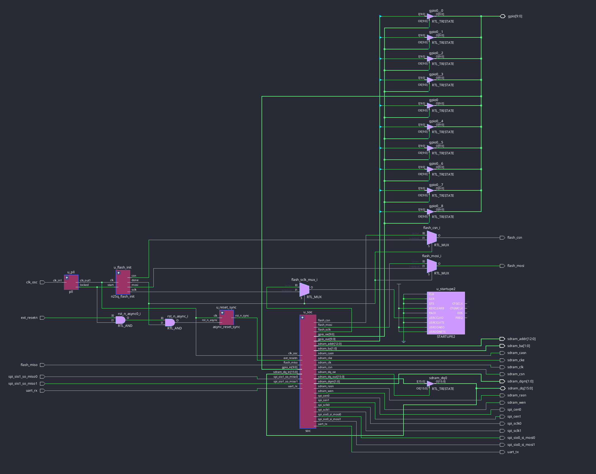
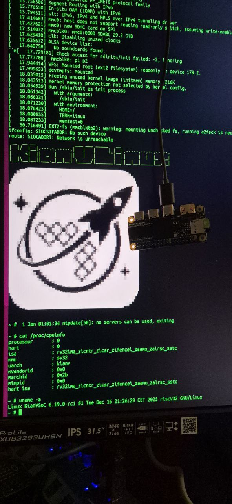

Yeah, this is my KianV Linux/XV6 SoC. It was reworked due to my ASICs; see here:
https://github.com/splinedrive/gf180mcu-kianv-rv32ima-sv32/

I have separated the CPU into a standalone project; see here:
https://github.com/splinedrive/kianv-rv32-linuxcore

This SoC has fewer features than the previous one. It supports external ROM
bootstrap read, SPI SD card access, 10 GPIOs, and a separate SPI bus, which I
will mainly use for a network device. You can choose the kernel and root
filesystem from the previous project; read more here:
https://github.com/splinedrive/kianRiscV/blob/master/linux_socs/kianv_mc_rv32ima_sv32/README.md

We support the following FPGAs: ULX3S, IcePi Zero, QMTech Wukong, and IceSugar
Pro. I hope I can finalize this project. I originally wanted to rework the
memory and SD card logic, but new approaches will be available in my next SoC,
StealthV.

